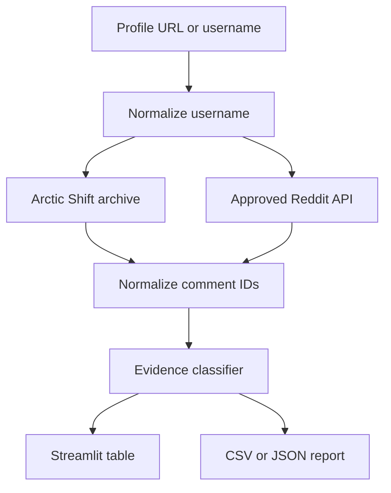

# ProfileLens

**An evidence-based Reddit profile visibility auditor built with Python and Streamlit.**

ProfileLens compares comments exposed by a Reddit public profile listing with
records returned by the Arctic Shift archive. Instead of treating every
missing comment as "hidden," it separates verifiable states such as live but
not listed, moderator-removed, user-deleted, archive-only, and outside the
comparison window.

> This project is designed for self-audits, consent-based demonstrations, and
> privacy education. It is not affiliated with Reddit or Arctic Shift.

## Why This Project Exists

Reddit lets people curate which communities appear on their profiles, but
profile visibility is not the same as deletion. A defensible demonstration
needs to distinguish three questions:

1. Did an archive capture the comment?
2. Does the comment appear in the current public profile listing?
3. Does Reddit still return the comment directly?

ProfileLens answers those questions separately and preserves uncertainty when
the sources cannot establish a cause.

## Features

- Accepts a Reddit profile URL, `u/username`, or plain username
- Searches archived comments through Arctic Shift without credentials
- Optionally compares Reddit's public user listing through approved API access
- Performs bounded direct-comment checks for unresolved records
- Protects against false claims caused by capped listing windows
- Provides a deterministic fictional demo with no network calls
- Exports CSV or JSON, with full comment text disabled by default
- Includes a Streamlit interface and scriptable command-line interface
- Ships with unit tests, linting, Docker support, and GitHub Actions CI

## Evidence Model

| Status | What the available evidence supports |
| --- | --- |
| Visible on public profile | The same comment ID appears in both sources. |
| Live but not listed | The archive contains it, the profile listing does not, and Reddit returns it directly. |
| Archived but not listed | The two listings differ, but no direct check established why. |
| Removed by moderator | Reddit returns its moderator-removal marker. |
| Deleted | Reddit returns its user-deletion marker. |
| Archive only | The archive has a record; Reddit did not provide a current state. |
| Outside comparison window | The record is older than the oldest item in a capped public listing. |
| Visible; not found in archive | Reddit exposes it, but the archive query did not return it. |

The app deliberately avoids labeling every discrepancy as hidden. See
[`docs/METHODOLOGY.md`](docs/METHODOLOGY.md) for the complete reasoning model.

## Architecture



The application does not maintain a database. Network results remain in the
current process/session unless the user explicitly downloads a report.

## Quick Start

### Windows PowerShell

```powershell
git clone https://github.com/Roidneg/ProfileLens_reddit_Visibility_auditor.git
cd ProfileLens_reddit_Visibility_auditor
python -m venv .venv
.\.venv\Scripts\Activate.ps1
python -m pip install --upgrade pip
pip install -e ".[dev]"
streamlit run app.py
```

### macOS or Linux

```bash
git clone https://github.com/Roidneg/ProfileLens_reddit_Visibility_auditor.git
cd ProfileLens_reddit_Visibility_auditor
python -m venv .venv
source .venv/bin/activate
python -m pip install --upgrade pip
pip install -e ".[dev]"
streamlit run app.py
```

Open the local URL printed by Streamlit. Choose **Demonstration** to explore
every major evidence state without credentials or network requests.

## Command-Line Usage

Generate a fictional report:

```bash
profilelens --demo --output demo-report.json
```

Run an authorized archive-only self-audit:

```bash
profilelens "https://www.reddit.com/user/example/" \
  --limit 100 \
  --acknowledge-authorized-use \
  --output audit.csv
```

Full comment bodies are omitted from exports unless `--include-body` is added.

## Optional Live Comparison

Archive mode does not require credentials. Live comparison uses PRAW and
Reddit's Data API. Reddit's current Responsible Builder Policy requires
developers to obtain explicit approval before accessing Reddit data through
the API. Do not use credentials unless Reddit approved the use case.

After approval, copy `.env.example` to `.env` and configure:

```dotenv
REDDIT_API_APPROVED=true
REDDIT_CLIENT_ID=your_client_id
REDDIT_CLIENT_SECRET=your_client_secret
REDDIT_USER_AGENT=profilelens/0.1 by u/your_username
```

Then use **Archive + live comparison** in Streamlit or run:

```bash
profilelens u/example \
  --compare-live \
  --max-probes 20 \
  --acknowledge-authorized-use \
  --output audit.json
```

The `REDDIT_API_APPROVED=true` gate is intentional. It helps prevent accidental
use of credentials without the required authorization.

## Controlled Demonstration

The strongest way to test profile curation is a before-and-after experiment:

1. Use an account you own.
2. Create two harmless comments in two suitable communities.
3. Record the initial profile and comment permalinks.
4. Hide one community through Reddit's profile-curation controls.
5. Run ProfileLens again using the same limits.
6. Confirm whether the comment is absent from the profile while still directly retrievable.

An archived copy proves that content was captured at some point. It does not,
by itself, prove that Reddit currently exposes the content or explain why a
profile no longer lists it.

## Testing and Quality Checks

```bash
ruff check .
pytest --cov=profilelens --cov-report=term-missing
```

Tests use only fictional records and mocked adapters. CI runs against Python
3.11 and 3.12.

## Docker

```bash
docker build -t profilelens .
docker run --rm -p 8501:8501 --env-file .env profilelens
```

Do not bake `.env` or Streamlit secrets into a container image.

## Privacy and Responsible Use

- Audit only accounts you own or have explicit permission to examine.
- Do not use the project for harassment, deanonymization, employment screening,
  or compiling dossiers about another person.
- Do not republish archived text unnecessarily.
- Treat archive results as incomplete historical records, not ground truth.
- Honor source removal processes and applicable platform terms.
- Keep API secrets local and rotate them immediately if exposed.

## Limitations

- Arctic Shift is an independent archive with incomplete coverage and no uptime guarantee.
- Reddit listings are capped and may not represent a complete account history.
- Direct lookups can fail because of permissions, account state, moderation, deletion, or transient errors.
- API behavior and platform policies can change.
- A result describes evidence available at the time of the run, not permanent truth.

## Roadmap

- Signed report manifests for repeatable before-and-after experiments
- Optional local SQLite project files for longitudinal self-audits
- Comparison snapshots without retaining full comment bodies
- Accessibility and screen-reader review
- Packaged releases for nontechnical users

## License

Released under the [MIT License](LICENSE).
