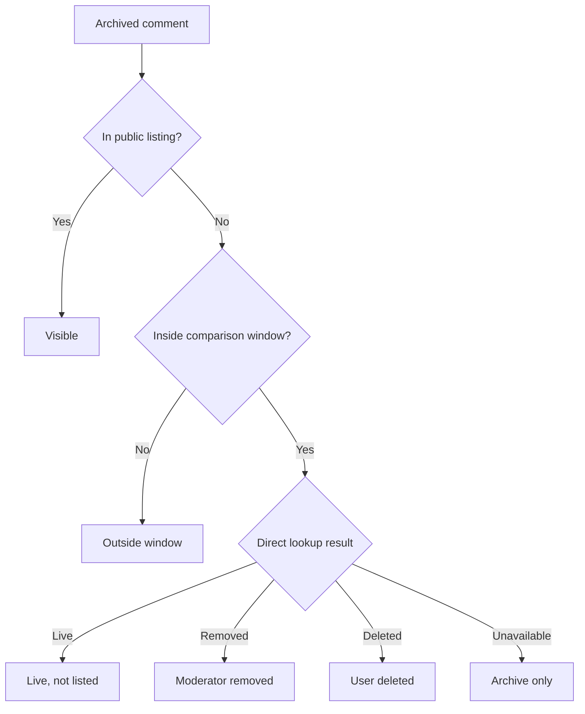

# Methodology

ProfileLens treats a visibility audit as an evidence-classification problem,
not a deleted-content recovery claim.

## Sources

### Arctic Shift

Arctic Shift is an independent archive. Its author search returns historical
records when they were captured. Coverage can be incomplete, recent content
may not yet be present, and a stored body may predate a later edit or deletion.

### Reddit Public Profile Listing

When approved access is configured, ProfileLens reads the public user-comment
listing through PRAW in read-only mode. It is used as the machine-readable
equivalent of what an unauthenticated observer can retrieve through the
approved API. Platform behavior can still differ across interfaces.

### Direct Comment Lookup

For archived comments absent from the compared listing window, ProfileLens can
perform a bounded direct lookup by comment ID. The lookup distinguishes:

- a body that remains live;
- Reddit's `[removed]` marker;
- Reddit's `[deleted]` marker; and
- an unavailable or inconclusive response.

## Comparison Window

User activity listings can be capped. If the number of public comments reaches
the requested limit, the oldest returned timestamp becomes the lower boundary
of the defensible comparison window. Older archive records are labeled
**Outside comparison window** rather than hidden.

This guard is essential. Without it, an ordinary pagination limit can be
mistaken for a privacy or moderation event.

## Classification Decision Tree

If the public profile was not compared, archive records are labeled
**Archived; public profile not compared**. If direct lookups are disabled or
the configured limit is exhausted, discrepancies remain **Archived but not
listed**.

## Claim Strength

### Supported Claim

> At the time of the audit, this comment was absent from the compared public
> profile window but remained directly retrievable from Reddit.

This is strong evidence of profile-level filtering or curation in a controlled
experiment, particularly when the researcher owns the account and records a
before-and-after settings change.

### Unsupported Claim

> Every archived comment missing from a profile was intentionally hidden.

The data cannot support this. Deletion, moderation, listing limits, archive
lag, API differences, account restrictions, and transient failures are
alternative explanations.

## Reproducibility Checklist

1. Record the UTC time of each run.
2. Keep source limits constant between runs.
3. Save the exact comment IDs and permalinks.
4. Use harmless, authorized test comments.
5. Capture settings changed between runs.
6. Export the report without full text unless the text is necessary.
7. State archive and API limitations alongside the result.

## Data Handling

ProfileLens has no application database. Data remains in process memory and is
only written when the operator downloads or directs the CLI to create a report.
Full bodies are opt-in for exports. Demonstration fixtures are fictional.
